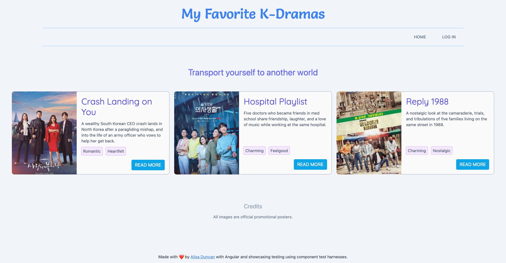

# Angular Component Harnesses FTW Sample Application and Tests



This is a K-Drama fan site showcasing component unit tests. There's examples of tests with and without test harnesses, as well as a custom component harness implementation and tests.

The code in this repo is used by [Angular Component Harnesses FTW!](https://componentharnessesftw.alisaduncan.dev/) presentation.

This project was generated with [Angular CLI](https://github.com/angular/angular-cli) version 14.1.0.

## Environment setup instructions

```console
git clone 
npm ci
```

Run `ng serve` for a dev server. Navigate to `http://localhost:4200/`. The application will automatically reload if you change any of the source files.

Run `ng test` to run the automated tests in this project.
